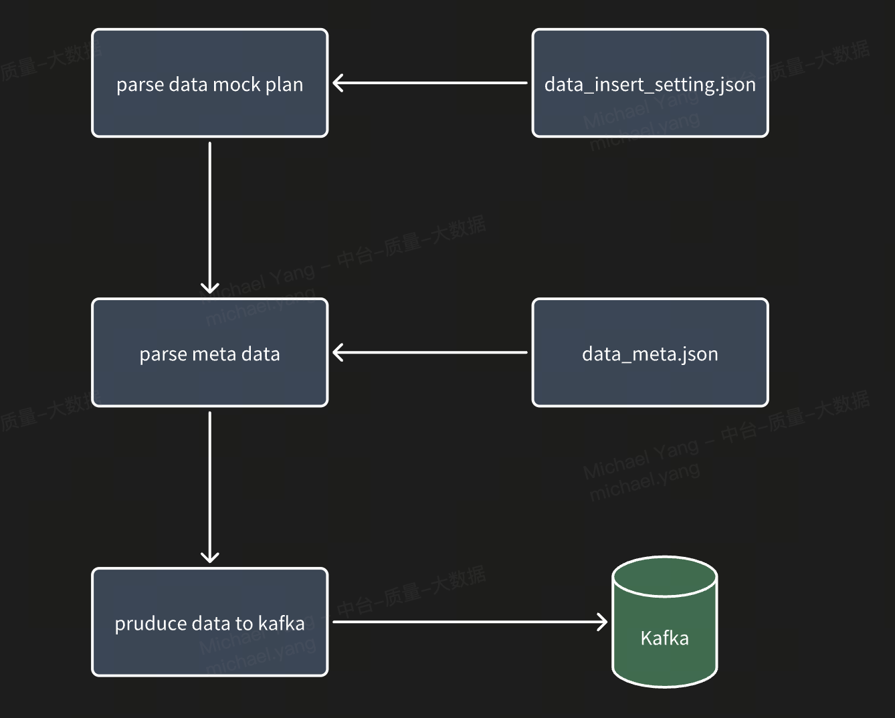

<script src="https://cdn.jsdelivr.net/npm/mermaid@10"></script>
# KAFKA DATA MOCK TOOL

# 1. workflow of insert data


# 2. usage

## 2.1. kafka config  - kafka.properties
```properties
## kafka  host
bootstrap.servers=de-test-kfk.cht.ww5sawfyut0k.bitsvc.io:9092  # your own brokers

## topic name
topic=michael-multiple-partition-test  # your own topic name

## group id
group.id=michael  # your own group id used for consumer


# PLAIN, SCRAM-SHA-256
sasl.mechanism=SCRAM-SHA-256

# username
sasl.username=xxx # your own username

# password
sasl.password=xxxx # your own password

## jaas conf
java.security.auth.login.config=kafka_client_jaas.conf
```

## 2.2. data mock plan - data_insert_setting.json
```json
{
  "count": 100,   // how many data to send to kafka
  "interval": 1,  // the interval of sending each item
  "fresh": true   // if generate new data to send to kafka. false: sending same data every round, true: generate new string to send
}
```

## 2.3. metadata of mock data - data_meta.json
```json
{
  "meta": [
    {
      "name": "testName",
      "dataType": "string",
      "dataLength": 88,
      "dataRange": ""
    },
    {
      "name": "testName2",
      "dataType": "integer",
      "dataLength": 10000,
      "dataRange": ""
    },
    {
      "name": "",
      "dataType": "json",
      "dataLength": 10000,
      "dataRange": {
        "key": "key",
        "value": "value",
        "length": 188
      }
    }
  ],
  "type": "list"
}
```
